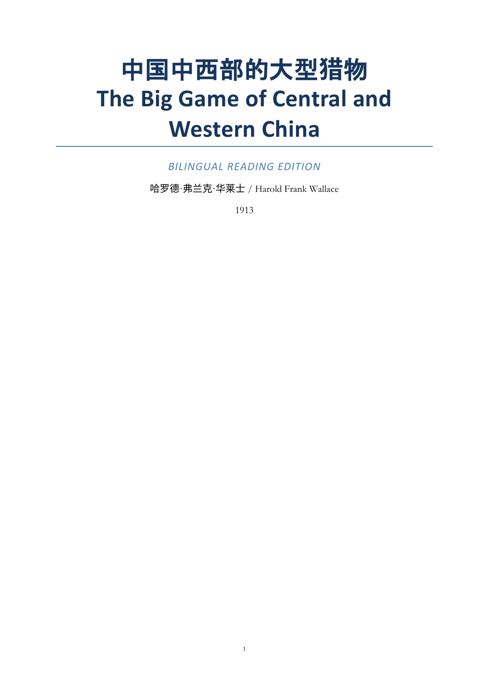
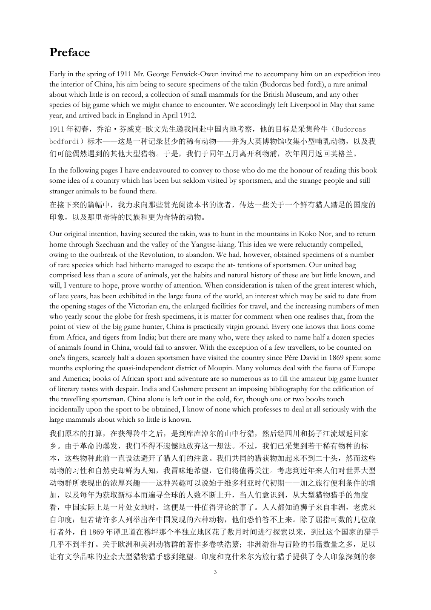
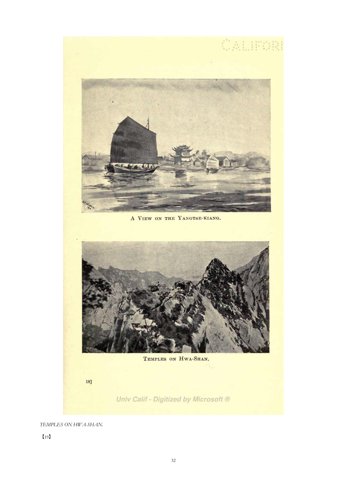
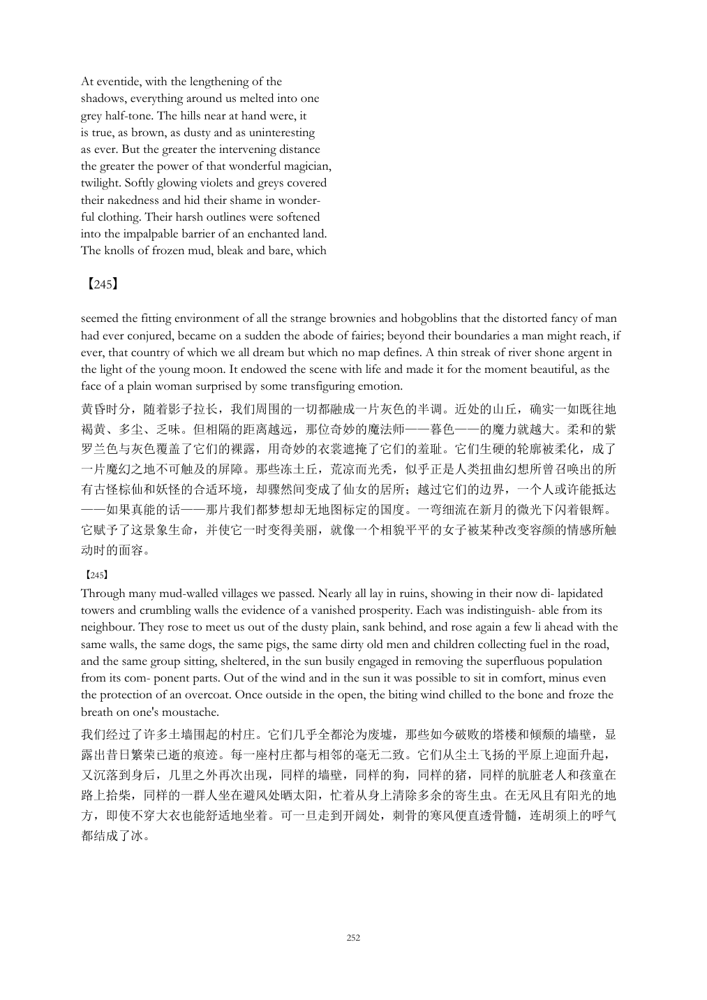

# Bookflow Scholar｜书流学术

**用你自己的 API，把论文、书籍与专著翻译成仍然“像一本书”的成品。**
**Bring your own API and translate scholarly PDFs, books, and monographs into editions that still read like books.**

[下载 0.8.0-rc.2 / Download](https://github.com/huanghaitck/bookflow-scholar/releases/tag/v0.8.0-rc.2) · [六语言手册 / Manuals](#使用手册--manuals) · [反馈问题 / Report an issue](https://github.com/huanghaitck/bookflow-scholar/issues/new?template=user_problem.yml) · [1.0 路线图 / Roadmap](docs/ROADMAP_1.0.md)

  
  
  

> 上图来自 Bookflow Scholar 已验收的真实完整成品，不是界面设计稿。
> These are pages from a real accepted full-book output, not UI mock-ups.

## 我们为什么做它｜Why this exists

很多 PDF 翻译工具擅长“把文字换成另一种语言”，但论文、历史书与专著还有另一半问题：**结构**。常见流程会把 PDF 压成一串文本，逐页翻译，结果是跨页句子被截断，页眉页脚混进正文，脚注和尾注失去位置，地图、照片、图注和版权信息被误删或放错，读者也无法再对应原版页码。

Many PDF translators are good at changing the language, but scholarly publications have a second problem: **structure**. A flat, page-by-page pipeline can split sentences at page boundaries, mix headers and footnotes into body text, detach figures from captions, discard historically useful front matter, and make the translated edition impossible to cite against the original.

Bookflow Scholar 面向的不是“复制粘贴式翻译”，而是：

**跨页恢复完整逻辑单元 → 整体翻译 → 按真实页界回插 `【原页码】` → 重建阅读版面。**

**Recover cross-page logical units → translate with context → reinsert `【original page】` at the true boundary → reconstruct the reading layout.**

## 独特价值｜What makes it different

| 中文 | English |
|---|---|
| **自有 API**：你选择文本与视觉 Provider、模型和预算；文档发往你配置的 Provider，而不是 Bookflow 托管的翻译服务器。 | **Bring your own API:** choose the text and vision providers, models, and budget. Documents go to the providers you configure, not to a Bookflow-hosted translation service. |
| **跨页语境**：先恢复被分页打断的句子、段落和逻辑单元，再整体翻译。 | **Cross-page context:** restore sentences, paragraphs, and logical units before translation. |
| **版面理解**：确定性文档处理结合多模态分析，识别正文、标题、页眉、页脚、脚注、尾注、图版、地图、表格与图注。 | **Layout-aware processing:** deterministic document logic works with multimodal analysis to distinguish body text, headings, headers, footers, notes, plates, maps, tables, and captions. |
| **独立翻译、正确回位**：页眉、页脚、脚注和尾注不混入正文；它们独立翻译后回到自己的位置。 | **Translate separately, rebuild correctly:** headers, footers, footnotes, and endnotes remain separate from body text and return to their proper locations. |
| **史料可定位**：`【245】` 这类标记保留原版真实页界，便于跨版本查证、引用与课堂讨论。 | **Citable history:** markers such as `【245】` preserve true original-page boundaries for verification, citation, and teaching. |
| **有判断的保留**：可保留具有版本学或史料价值的书名页、版权页、地图、照片与图版；无关装饰、扫描噪声和版权声明图片可在审阅中排除。 | **Selective preservation:** retain bibliographically or historically meaningful title/copyright pages, maps, photos, and plates, while excluding irrelevant decoration, scan noise, or notice images during review. |
| **三种动态成品**：按原书名与目标语言生成原版、目标语言版和双语版，不固定测试书名、页数、路径或 ID。 | **Three dynamic editions:** produce source, target-language, and bilingual editions with document-aware names—without hard-coded books, page counts, paths, or IDs. |

  

上页中的 `【245】` 位于原文真实换页处，但跨页内容已经先作为完整语义单元翻译。这样既保留阅读连贯性，也保留史料位置。
The `【245】` marker sits at the original physical boundary, while the surrounding content was translated as a complete semantic unit first. Reading continuity and historical location are both preserved.

## 自有 API 与隐私｜Your API, your choice

- 支持简体中文、英语、法语、德语、日语和西班牙语；已覆盖六种语言两两双向的 30 个有向组合。
- 在桌面端配置文本与视觉 Provider；密钥通过 Windows Credential Manager 保存。
- 可按材料选择只用文本模型，或在复杂版面、地图、图版与疑难页上启用多模态模型。
- 长任务支持暂停、恢复、重启续跑、取消与失败重试。
- 请勿把 API Key、机密文档或未脱敏日志提交到 Issue。

---

- Simplified Chinese, English, French, German, Japanese, and Spanish are supported; all 30 directed pairs have been exercised.
- Configure text and vision providers in the desktop app. Keys are stored through Windows Credential Manager.
- Use text-only processing where appropriate, and enable multimodal review for complex layouts, maps, plates, and difficult pages.
- Long jobs support pause, resume, restart recovery, cancellation, and failed-step retry.
- Never post API keys, confidential documents, or unredacted logs in an issue.

## 快速开始｜Quick start

1. 安装 `Bookflow-Scholar-0.8.0-rc.2-setup.exe`，或解压便携 ZIP。
   Install the setup package, or extract the portable ZIP.
2. 打开客户端，先选择“创建项目”。
   Open the app and choose **Create project**.
3. 进入项目，配置文本与视觉 Provider 并保存凭据。
   Configure the text and vision providers and save credentials.
4. 导入 PDF，选择源语言与目标语言，然后点击“开始”。
   Import a PDF, select source and target languages, then choose **Start**.
5. 如有需要，审阅术语表包和疑难页包。
   Review the glossary and difficult-page packages when they are produced.
6. 在输出目录中打开原版、目标语言版与双语版。
   Open the source, target-language, and bilingual editions from the output folder.

[LibreOffice](https://www.libreoffice.org/download/) 是经过验证的 Office 文档渲染路径，属于可选但推荐的外部依赖。
[LibreOffice](https://www.libreoffice.org/download/) is optional but recommended for the validated office-document rendering path.

## 使用手册｜Manuals

- [简体中文](docs/i18n/README.zh-Hans.md)
- [English](docs/i18n/README.en.md)
- [Français](docs/i18n/README.fr.md)
- [Deutsch](docs/i18n/README.de.md)
- [日本語](docs/i18n/README.ja.md)
- [Español](docs/i18n/README.es.md)

## 开放源码开发与反馈｜Open development and feedback

Bookflow Scholar 公开源码、构建材料、发布校验说明与问题清单，希望和研究者、译者、档案工作者、出版从业者以及开源开发者一起改进。欢迎提交可复现的 [Issue](https://github.com/huanghaitck/bookflow-scholar/issues/new?template=user_problem.yml) 或 Pull Request；请说明文档类型、页数、语言组合、Provider、失败步骤与脱敏后的日志。

Bookflow Scholar develops in the open, including source code, build materials, release verification, and issue tracking. Researchers, translators, archivists, publishing professionals, and open-source developers are welcome to contribute reproducible issues and pull requests. Please include the document type, page count, language pair, provider, failed step, and redacted logs.

本 RC 仓库尚未附最终开源许可证；复用、再发布与商业使用规则将在 1.0 前明确。当前请以仓库版权声明为准。
The final open-source license has not yet been selected for this release candidate. Reuse, redistribution, and commercial-use terms will be made explicit before 1.0; until then, the repository copyright notice applies.

## 感谢开源生态｜Built with gratitude

这个项目能够完成，离不开开源社区。特别感谢：

- [Python](https://www.python.org/) 与 [Rust](https://www.rust-lang.org/)；
- [Tauri](https://tauri.app/)、[React](https://react.dev/) 与 [Vite](https://vite.dev/)；
- [PyMuPDF](https://pymupdf.readthedocs.io/)、[Poppler](https://poppler.freedesktop.org/) 与 [LibreOffice](https://www.libreoffice.org/)；
- [PyInstaller](https://pyinstaller.org/) 与 [NSIS](https://nsis.sourceforge.io/)；
- 以及发布包 `THIRD_PARTY_LICENSES.md` 中列出的全部依赖与维护者。

This project stands on the work of the open-source community. We are grateful to the maintainers and contributors of the projects above, and to every dependency documented in the release package’s `THIRD_PARTY_LICENSES.md`.

## 当前版本与 1.0｜Release status and 1.0

`0.8.0-rc.2` 已完成真实桌面端安装、处理、暂停/恢复、覆盖安装、卸载与数据恢复验收。下一阶段将重点放在稳定性、可解释的版面审阅、Provider 兼容性、可维护发布流程、正式开源许可与更完整的用户文档，详见 [1.0 路线图](docs/ROADMAP_1.0.md)。

This release candidate has completed real desktop install, processing, pause/resume, upgrade, uninstall, and data-recovery acceptance. The path to 1.0 focuses on stability, explainable layout review, provider compatibility, maintainable releases, a formal open-source license, and deeper documentation. See the [1.0 roadmap](docs/ROADMAP_1.0.md).

`0.8.0-rc.2` 暂未签名。Windows 可能显示 SmartScreen 警告；运行前请核验发布页中的 SHA-256。便携 ZIP 可供不希望运行安装器的用户使用。
`0.8.0-rc.2` is unsigned. Windows may show a SmartScreen warning; verify the published SHA-256 before running it. A portable ZIP is available for users who prefer not to run an installer.

Copyright © 2026 huanghaitck.
